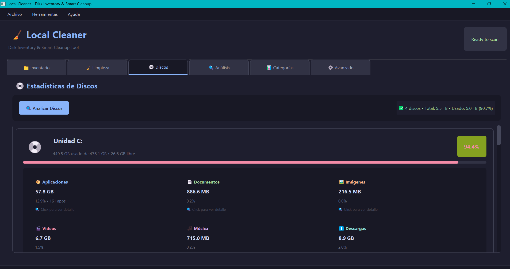
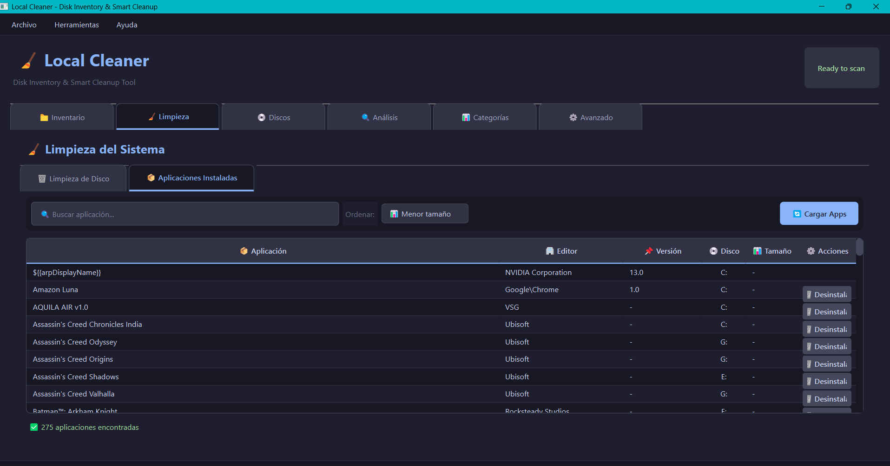

<p align="center">
  
</p>

<h1 align="center">🧹 Local Cleaner</h1>

<p align="center">
  <strong>Professional Disk Analysis & Cleanup Tool for Windows</strong>
</p>

<p align="center">
  <a href="#features">Features</a> •
  <a href="#screenshots">Screenshots</a> •
  <a href="#installation">Installation</a> •
  <a href="#usage">Usage</a> •
  <a href="#tech-stack">Tech Stack</a> •
  <a href="#contributing">Contributing</a>
</p>

<p align="center">
  
  
  
  
</p>

---

## 📋 Overview

**Local Cleaner** is a professional-grade Windows desktop application for intelligently scanning, analyzing, and managing disk storage. Built with Python and PySide6, it provides deep insights into what's consuming your disk space and safely handles cleanup operations with multiple confirmation layers.

Perfect for:
- 🏢 IT professionals managing multiple workstations
- 👨‍💻 Developers cleaning up development environments
- 🎮 Gamers reclaiming space from old game files
- 👤 Regular users wanting to understand their disk usage

---

## ✨ Features

### 📁 Comprehensive Disk Scanning
- Multi-drive scanning (C:, D:, E:, etc.) with recursive indexing
- Complete file metadata extraction (size, dates, hashes)
- Real-time progress tracking with pause/cancel support
- Efficient SQLite database for fast searches

### 📊 Smart Categorization System
Automatic classification into **11 categories** with confidence levels:

| Category | Description | Examples |
|----------|-------------|----------|
| 🖥️ System | Windows and system files | `C:\Windows`, drivers |
| 📦 Applications | Installed programs | Program Files |
| 🎮 Games | Game installations | Steam, Epic, Xbox |
| 🎬 Media | Photos, videos, music | MP4, JPG, MP3 |
| 📄 Documents | Office and text files | PDF, DOCX, TXT |
| 💻 Development | Code and dev tools | node_modules, .git |
| ⬇️ Downloads | Downloaded files | Downloads folder |
| 📚 Archives | Compressed files | ZIP, RAR, 7Z |
| 💿 Installers | Setup files | EXE, MSI installers |
| 💾 Backups | Backup files | ISO, disk images |
| ❓ Unknown | Unclassified files | Other |

### 🧹 System Cleanup (Windows-Style)
Similar to Windows Disk Cleanup but with more control:
- **Temporary Files**: System and user temp folders
- **Browser Cache**: Chrome, Firefox, Edge cache
- **Windows Update Cleanup**: Old update files
- **Recycle Bin**: Empty with size preview
- **Thumbnail Cache**: Windows thumbnail database

### 📱 Installed Apps Manager
- View all installed applications from Windows Registry
- Sort by name, size, or installation drive
- One-click uninstall with confirmation
- See which drive each app is installed on

### 💿 Disk Statistics Dashboard
- Per-drive space analysis with visual breakdown
- Category-based space usage (Apps, Documents, Media, etc.)
- **Clickable categories** to see detailed file/app lists
- Color-coded usage indicators (green/yellow/red)

### 🔒 Safe Cleanup Operations
Four action modes for complete flexibility:

| Mode | Description | Recovery |
|------|-------------|----------|
| 🔍 Dry Run | Preview only, no changes | N/A |
| 📦 Quarantine | Move to secure folder | ✅ Full |
| 🗑️ Recycle Bin | Send to Windows trash | ✅ Easy |
| 🔥 Permanent | Delete forever | ❌ None |

---

## 📸 Screenshots

<p align="center">
  
  <br/>
  <em>Main application window with modern Catppuccin dark theme</em>
</p>

<p align="center">
  
  <br/>
  <em>System cleanup with selectable categories and size preview</em>
</p>

<p align="center">
  
  <br/>
  <em>Disk statistics with clickable category breakdown</em>
</p>

<p align="center">
  
  <br/>
  <em>Installed applications manager with sorting and disk location</em>
</p>

---

## 🚀 Installation

### Prerequisites
- Windows 10/11 (64-bit)
- Python 3.10 or higher

### Quick Start

```bash
# Clone the repository
git clone https://github.com/RanuK12/Local_CleaningPC-App.git
cd Local_CleaningPC-App

# Create virtual environment (recommended)
python -m venv venv
venv\Scripts\activate

# Install dependencies
pip install -r requirements.txt

# Run the application
python main.py
```

### 📦 Download Standalone Executable

**No Python installation required!** Download the pre-built executable:

1. Go to [Releases](https://github.com/RanuK12/Local_CleaningPC-App/releases)
2. Download `LocalCleaner-v1.1.0-Windows.zip`
3. Extract and run `LocalCleaner.exe`

### Build from Source

```bash
# Install build dependencies
pip install pyinstaller

# Build using the provided script
python build_installer.py --clean

# Output: dist/LocalCleaner.exe (~47 MB)
# Also creates: dist/LocalCleaner-v1.1.0-Windows.zip
```

---

## 💡 Usage

### Basic Workflow

1. **Launch** the application with `python main.py`
2. **Scan** your drives from the Inventory tab
3. **Analyze** space usage in the Disk Statistics tab
4. **Clean** unnecessary files from the Cleanup tab
5. **Manage** installed applications from the Apps tab

### Keyboard Shortcuts

| Shortcut | Action |
|----------|--------|
| `Ctrl+S` | Start scan |
| `Ctrl+Q` | Quit application |
| `F5` | Refresh current view |

---

## 🛠️ Tech Stack

- **Python 3.10+** - Core programming language
- **PySide6 (Qt6)** - Modern GUI framework
- **SQLite** - Local database for file indexing
- **Windows Registry API** - For reading installed apps

### Architecture

```
Local_CleaningPC-App/
├── main.py                  # Application entry point
├── src/
│   ├── core/                # Business logic
│   │   ├── scanner.py       # Disk scanning engine
│   │   ├── analyzer.py      # File analysis
│   │   ├── categorizer.py   # Smart categorization
│   │   ├── cleaner.py       # Cleanup operations
│   │   └── app_analyzer.py  # Installed apps detection
│   ├── db/                  # Database layer
│   │   ├── database.py      # SQLite operations
│   │   └── models.py        # Data structures
│   ├── ui/                  # User interface
│   │   ├── main_window.py   # Main window
│   │   ├── dialogs.py       # Settings & confirmations
│   │   └── tabs/            # Tab components
│   │       ├── inventory_tab.py
│   │       ├── analysis_tab.py
│   │       ├── category_tab.py
│   │       ├── cleanup_tab.py
│   │       ├── apps_cleanup_tab.py
│   │       └── disk_stats_tab.py
│   └── utils/               # Utilities
│       ├── config.py        # Configuration
│       ├── logger.py        # Logging system
│       └── hash_utils.py    # File hashing
├── resources/               # App resources
├── tests/                   # Test suite
└── IMG/                     # Screenshots
```

---

## ⚙️ Configuration

Edit `config.json` to customize:

```json
{
  "scan_paths": ["C:\\Users"],
  "min_file_size_mb": 1,
  "max_file_age_days": 30,
  "database_path": "data/cleaner.db",
  "log_level": "INFO"
}
```

---

## 🔐 Security & Privacy

- ✅ **100% Offline** - No internet required or used
- ✅ **No Telemetry** - Zero data collection
- ✅ **No Auto-Delete** - Explicit confirmation required
- ✅ **Audit Trail** - Complete action logs
- ✅ **Permission Aware** - Respects Windows ACLs

---

## ⚡ Performance

- **Scan Speed**: ~10,000 files/second
- **Database**: Efficiently handles 1M+ files
- **Memory**: ~200-500 MB (varies with indexed files)
- **Threading**: Non-blocking UI using QThread workers

---

## 🤝 Contributing

Contributions are welcome! Please feel free to submit a Pull Request.

1. Fork the repository
2. Create your feature branch (`git checkout -b feature/AmazingFeature`)
3. Commit your changes (`git commit -m 'Add some AmazingFeature'`)
4. Push to the branch (`git push origin feature/AmazingFeature`)
5. Open a Pull Request

---

## 📝 License

This project is licensed under the MIT License - see the [LICENSE](LICENSE) file for details.

---

## 👤 Author

**Emilio Ranucoli**

- GitHub: [@RanuK12](https://github.com/RanuK12)
- LinkedIn: [Emilio Ranucoli](https://www.linkedin.com/in/emilio-ranucoli/)

---

## 🙏 Acknowledgments

- [PySide6](https://www.qt.io/qt-for-python) for the excellent Qt bindings
- [Catppuccin](https://github.com/catppuccin/catppuccin) for color palette inspiration

---

<p align="center">
  Made with ❤️ and Python
</p>

<p align="center">
  <strong>Version 1.0.0</strong> • January 2026
</p>
